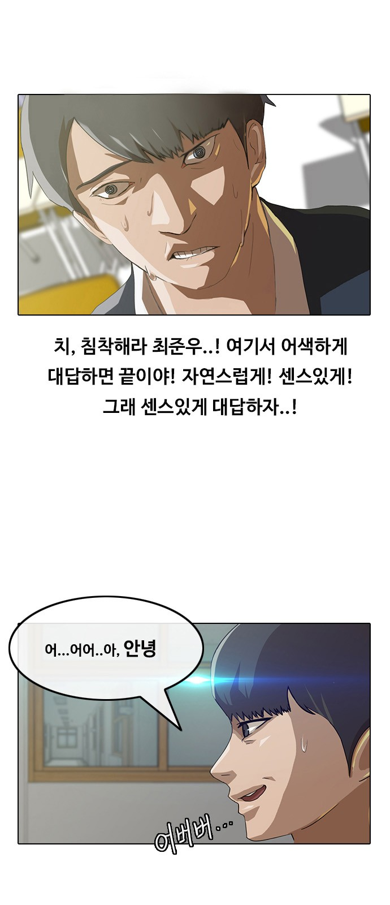
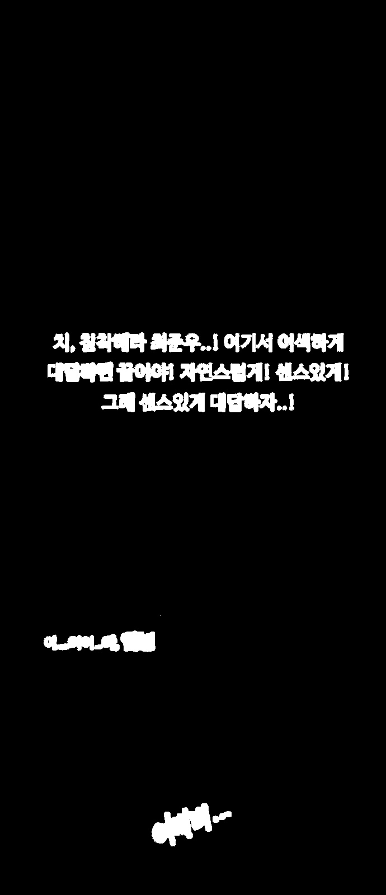
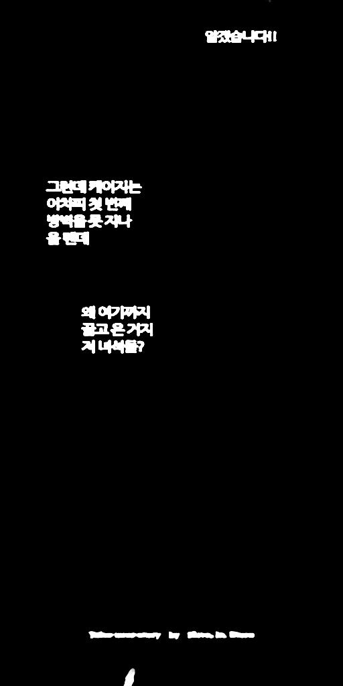
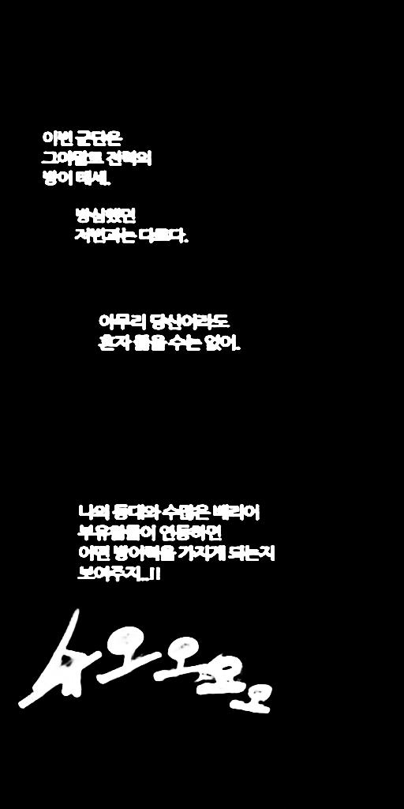
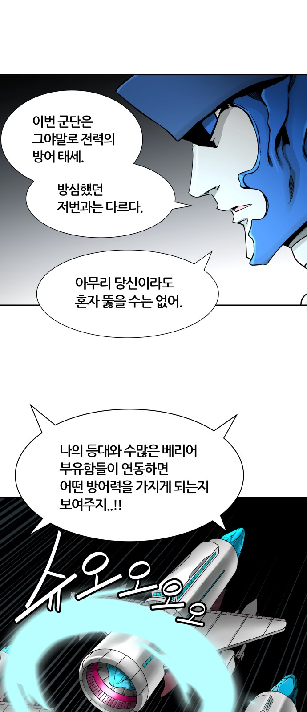

## Image Text Semantic Segmentation

 colab, python3.6.9, keras2.2.5, tensorflow1.15.1, opencv-python4.2.0 


### 소개

- 만화 이미지를 기반으로 배경과 text를 분리하는 것입니다. (데이터셋은 포토샵을 이용해 수작업으로 구축)


                         


### 방법

#### 1. albumentations 라이브러리 설치 

1-1) albumentation - image augmentation 라이브러리. 다른 image augmentation 관련 library들과 비교해서 가장 큰 특징은 빠르다는 점이며, numpy, OpenCV, imgaug 등 여러 library(OpenCV 가 메인)들을 기반으로 optimization을 하였기 때문에 다른 library들보다 빠른 속도를 보여줍니다.

`!pip install -U git+https://github.com/albu/albumentations --no-cache-dir`

#### 2. Model , Transfer Learning , loss function 

1-2) https://github.com/qubvel/segmentation_models  참고

#### 3. parameter 값 입력

```
BACKBONE = 'efficientnetb3'#'resnet34'
BATCH_SIZE = 1
LR = 0.0001
EPOCHS = 40
preprocess_input = sm.get_preprocessing(BACKBONE)
```

```
# define network parameters
n_classes = 1
activation = 'sigmoid' if n_classes == 1 else 'softmax'

#create model
# model = sm.PSPNet(BACKBONE, classes=n_classes, activation=activation)
#model = sm.Unet(BACKBONE, classes=n_classes, activation=activation, input_shape=(None,None,3))
model = sm.FPN(BACKBONE, classes=n_classes, activation=activation, input_shape=(None,None,3))
```

```
# define optomizer
optim = keras.optimizers.Adam(LR)

# Segmentation models losses can be combined together by '+' and scaled by integer or float factor
dice_loss = sm.losses.DiceLoss()
focal_loss = sm.losses.BinaryFocalLoss() if n_classes == 1 else sm.losses.CategoricalFocalLoss()
total_loss = dice_loss + (1 * focal_loss)

# actulally total_loss can be imported directly from library, above example just show you how to manipulate with losses
# total_loss = sm.losses.binary_focal_dice_loss # or sm.losses.categorical_focal_dice_loss 

metrics = [sm.metrics.IOUScore(threshold=0.5), sm.metrics.FScore(threshold=0.5)]

# compile keras model with defined optimozer, loss and metrics
model.compile(optim, total_loss, metrics)
```

#### 4. 주의할 점 

```
dataset_train = Dataset(x_train_load, y1_train_load, augmentation=get_training_augmentation(), preprocessing=get_preprocessing(preprocess_input))
dataset_val = Dataset(x_val_load, y1_val_load, augmentation=get_validation_augmentation(), preprocessing=get_preprocessing(preprocess_input))
train_dataloader = Dataloder(dataset_train, BATCH_SIZE, shuffle=True)
valid_dataloader = Dataloder(dataset_val, batch_size=1, shuffle=False)
```

- 데이터 albumentation 적용

```
# test_img 전처리
test_img = preprocess_input(test_img2)
```

- 테스트 데이터 전처리 적용 


### 모델 정보

model : FPN (U-Net 상위)

backbone : efficientnetb3

input_shape : (1536,768,3)

iou : 0.78 

Data : trainSet - 839  , valSet - 24 ,testSet - 16 , PNG

(png 파일은 비손실압축 방식으로 원본이 훼손이 되지 않지만 jpg파일은 손실압축으로 원본 자체가 훼손됩니다.)

### 결과 

    
  
